## Hey there! 👋

- 🌱I'm a student majoring in Electronic Information Engineering at Beijing University of Posts and Telecommunications. I'm looking forward to being a researcher one day!
- 💬In fact, I don't know what I will do here exactly. But maybe I will do something randomly.
- 🔭 I’m currently working on machine learning, especially on language model inference and affective computing.
- 💻 I'm currently learning   
- 📫 How to reach me: hua_ji@outlook.com

<!--
**Nanji-Huaji/Nanji-Huaji** is a ✨ _special_ ✨ repository because its `README.md` (this file) appears on your GitHub profile.

Here are some ideas to get you started:  

- 🔭 I’m currently working on ...
- 🌱 I’m currently learning ...
- 👯 I’m looking to collaborate on ...
- 🤔 I’m looking for help with ...
- 💬 Ask me about ...
- 📫 How to reach me: ...
- 😄 Pronouns: ...
- ⚡ Fun fact: ...
-->
